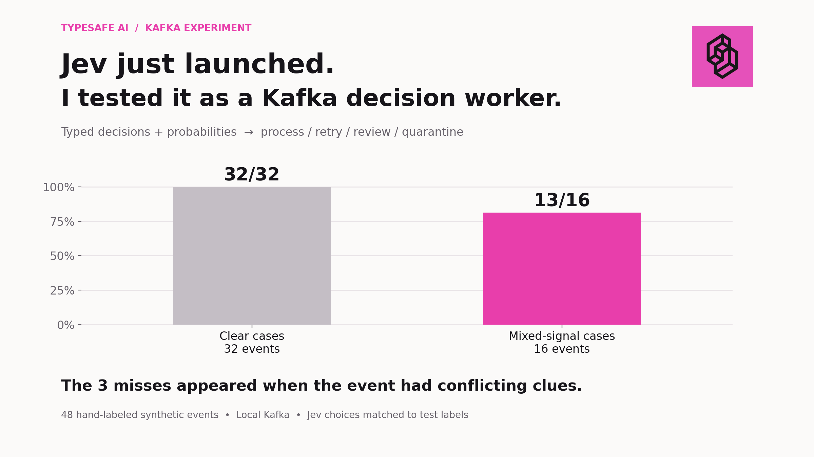

# Jev × Kafka: semantic event routing

A Kafka event can pass schema validation and still describe an impossible or ambiguous business state. I tested whether Jev could choose where to send those events: **process, retry, human review, or quarantine**.

## Results

| Synthetic test cases | Jev choices matching labels |
| --- | ---: |
| Clear events | 32/32 |
| Events with conflicting clues | 13/16 |

I also ran 200 events through the Kafka worker. Jev matched all 200 labels, with **388 ms median** and **476 ms p95** API round-trip latency. Those events reused eight scenarios across 25 order contexts, so that run tests routing consistency rather than 200 independent situations.

## How it works

`events.raw` → Jev worker → `events.normal`, `events.retry`, `events.human_review`, or `events.quarantine`

The events and ground-truth labels are in `data/`. The worker is in `worker.py`, and the recorded decisions are in `results/`.

**Scope:** This is a small experiment with labeled synthetic data, not a production accuracy benchmark.
